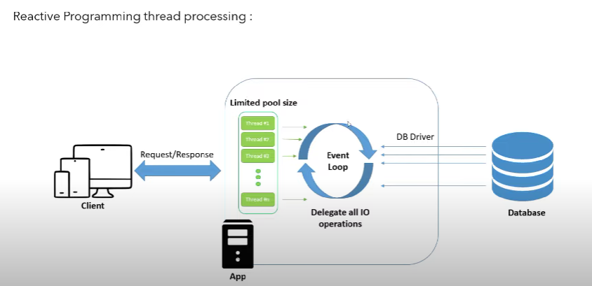
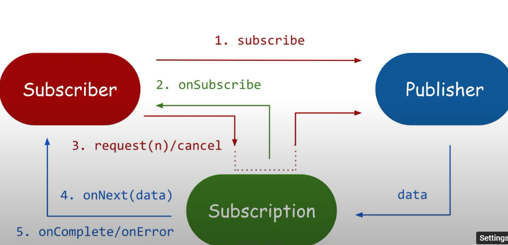
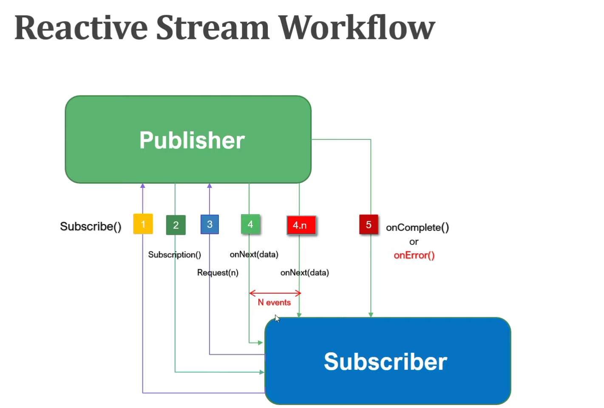

<b> Traditional REST API :  (Synchronous and Blocking) </b>
	
	If number of requests are more than the thread pool available than those requests have to wait until any of the threads is free. (Thread per request concept).

<b> In Reactive programming :  (Asynchronous and Non-blocking) </b>
	
	When a thread receives a request from client, it sends an 'event' to the database and tells to just finish the job (request) mentioned in that 'event' and after this the thread becomes free, now whenever the dB finishes that 'event' , just assign that response to any available thread and publish a 'complete event' to the initial thread.
	All other threads do the same and throw the events in an event loop.

<b> Data Types in Reactive Programming : </b> Mono & Flux     

<b> REACTIVE STREAM WORKFLOW </b>

-> Publisher: Emits a sequence of events to subscribers according to the demand received from its subscribers. A publisher can serve multiple subscribers.

		public interface Publisher<T> { 
	
			public void subscribe(Subscriber<? super T>  s); 
		}
	

-> Subscriber: Receives and processes events emitted by a Publisher. Please note that no notifications will be received until Subscription#request(long) is called to signal the demand. It has four methods to handle various kinds of responses received.
	
		public interface Subscriber<T> { 
			public void onSubscribe(Subscription s);
			public void onNext(T t); 
			public void onError(Throwable t); 
			public void onComplete(); 
		}
		

-> Subscription: Defines a one-to-one relationship between a Publisher and a Subscriber. It can only be used once by a single Subscriber. It is used to both signal desire for data and cancels demand (and allow resource clean-up).
		
		public interface Subscription<T> { 
			public void request(long n); 
			public void cancel(); 
		}
		
-> Processor: Represents a processing stage consisting of both a Subscriber and a Publisher and obeys the contracts of both.
		
		public interface Processor<T,R> extends Subscriber<T>, Publisher<R> { 
		
		}
